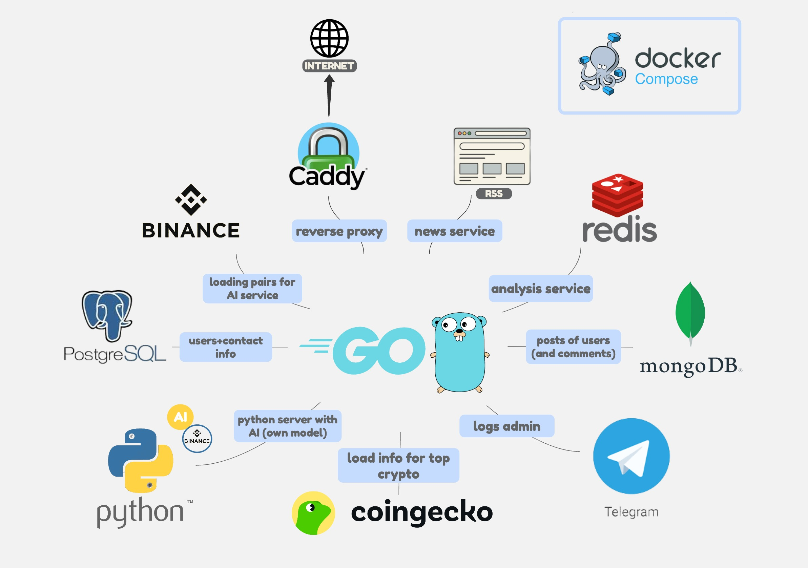
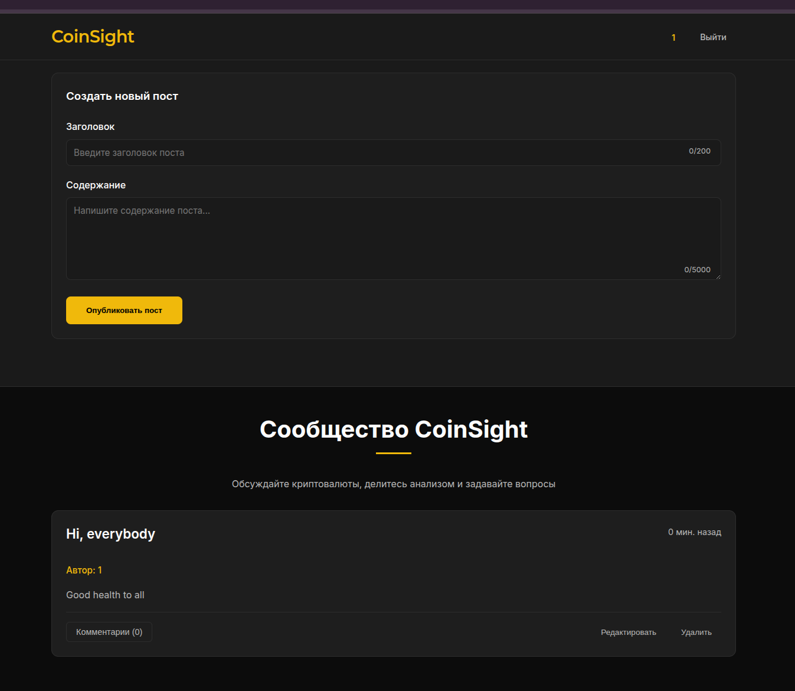
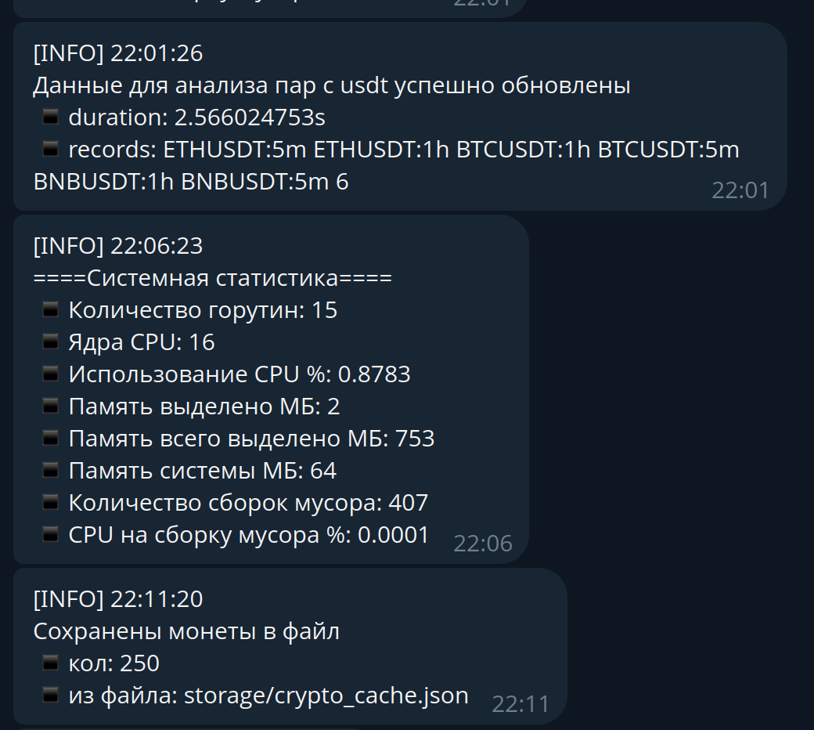

# CoinSight — Сервис анализа криптовалют

> Комплексный инструмент для мониторинга, анализа и обсуждения криптоактивов.  
> Отслеживайте топ-монеты, стройте графики, сохраняйте избранные пары и делитесь аналитикой в сообществе.

🔗 [**Посетить сайт** → coinsight.site](https://www.coinsight.site/)

---

## Технологический стек


### Бэкенд (Go)
- **Язык**: Go (Golang)
- **API стиль**: RESTful
- **Архитектура**: Многомодульная (clean separation of concerns: `handlers`, `services`, `storage`, `models`)
- **Интеграции**:
  - Binance API — рыночные данные, свечи, ликвидность
  - CoinGecko API — рейтинги, метаданные, тренды
  - Telegram Bot API — логирование в production

### Внешний аналитический сервис (Python, *в разработке*)
- REST API
- Запрос свечей  и подсчет индикаторов
- Интеграция с Binance API для подготовки данных ML-модели
- Анализ через натренерованную мной модель, котороая основывается на логистической регрессии

### Базы данных
| СУБД       | Назначение                                         |
|------------|----------------------------------------------------|
| PostgreSQL | Реляционные данные: пользователи, обращения в поддержку |
| MongoDB    | Документы: посты, комментарии|
| Redis      | Кэширование частых запросов (например, свечи пар, индикаторы) |

### Фронтенд
- Vanilla stack: HTML5 / CSS3 (адаптивный) / JavaScript (ES6+)

### Прокси & маршрутизация
- **Caddy** — reverse-proxy, HTTPS, простая конфигурация

### Инфраструктура
- **Docker** — контейнеризация всех сервисов
- **Docker Compose** — оркестрация: Go-бэкенд, PostgreSQL, MongoDB, Redis, Caddy

---

## Конфигурационные флаги

| Флаг          | Описание |
|---------------|----------|
| `LAUNCH_LOC`  | Определяет окружение:<br>— `prod`: логи → Telegram, данные → API<br>— `dev`/`local`: логи → `stdout`, данные → локальный кэш (`.cache/`) |
| `LOG_LEVEL`   | Уровень логирования: `debug`, `info`, `warn`, `error` |
| `PROF_FLAG`   | Активирует **удалённое профилирование**:<br>— `/debug/pprof/`<br>— `/debug/pprof/profile`<br>— `/debug/pprof/trace`<br>— `/debug/pprof/symbol`<br>— `/debug/pprof/cmdline` |

> *Для выявления узких мест в production без остановки сервиса.*

---

## Обзор API

### Аналитика и рыночные данные
| Endpoint                        | Описание |
|---------------------------------|----------|
| `/api/allFavoriteCoin`          | Список избранных монет пользователя |
| `/api/changeFavoriteCoin`       | Добавление или удаление монеты из избранного |
| `/api/all-pairs`                | Популярные торговые пары с Binance |
| `/api/select-pair`              | Выбор пары для дальнейшего анализа |
| `/api/pair`                     | Данные по паре: свечи, объёмы, динамика (для графиков и теханализа) |
| `/api/available`                | Полный перечень пар, доступных для анализа |
| `/crypto-top`                   | Топ криптовалют по рыночной капитализации (источник: CoinGecko) |

### Сообщество: посты и комментарии
| Endpoint                       | Описание |
|--------------------------------|----------|
| `/api/posts/create`            | Создание нового поста |
| `/api/comments/create`         | Создание комментария к посту |
| `/api/posts`                   | Загрузка последних 100 постов (по убыванию времени) |
| `/api/comments`                | Загрузка последних 100 комментариев |
| `/api/posts/update`            | Редактирование своего поста |
| `/api/posts/delete`            | Удаление своего поста |
| `/api/comments/update`         | Редактирование своего комментария |
| `/api/comments/delete`         | Удаление своего комментария |

### Аутентификация и поддержка
| Endpoint             | Описание |
|----------------------|----------|
| `/register`          | Регистрация нового пользователя |
| `/login`             | Авторизация и получение сессии |
| `/logout`            | Завершение сессии |
| `/check-Sess-Id`     | Проверка наличия активной сессии на устройстве |
| `/contact`           | Отправка обращения в службу поддержки |
| `/news`              | Агрегированные криптоновости *(в разработке)* |
| `/pairs`             | Передача пары на внешний Python-сервис для углублённого анализа (свечи, индикаторы) |

> Все операции с изменением данных (посты, комментарии, избранное) защищены проверкой ownership и авторизацией.

---
## Запуск локально

```bash
git clone https://github.com/altuhov/crypto-insight.git
docker-compose up --build
```

----

## Миграции
```bash
# запускаем постгрес
docker compose up postgres -d

# Применить все миграции
docker compose run --rm migrate up

# Посмотреть статус
docker compose run --rm migrate status

# Откатить последнюю миграцию
docker compose run --rm migrate down

# Откатить до конкретной версии (например, 1)
docker compose run --rm migrate down 1

# Сбросить всё (down всех миграций)
docker compose run --rm migrate reset

# Узнать текущую версию
docker compose run --rm migrate version

```

---
## Скриншоты
 
<div align="center">

### Регистрация и вход  
  
*Простая и безопасная регистрация с валидацией*

---

### Интерфейс анализа пары  
  
*Динамика цены, объёмы, свечи и ключевые метрики*

---

### Форма создания поста  
  
*Редактор и лента с комментариями*

---

### Лента новостей  
  
*Криптоновости*

---

### Логирование в Telegram  
  
*Уведомления об ошибках и событиях в production-режиме*

</div>
